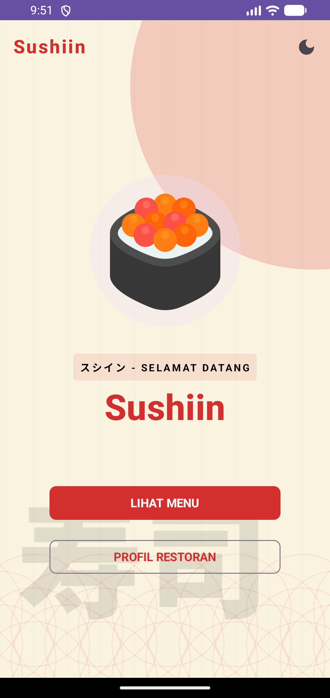
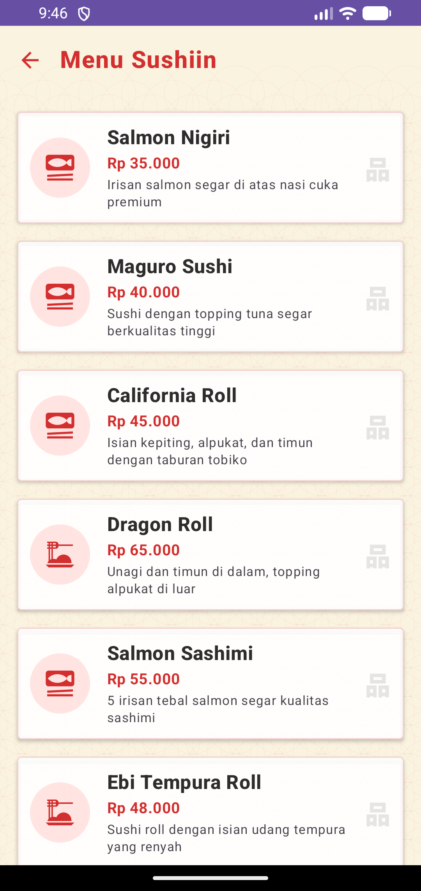
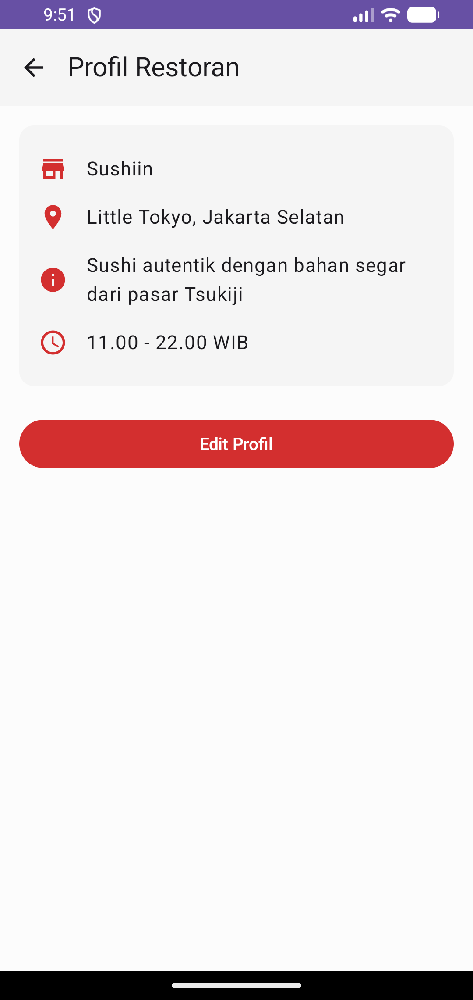
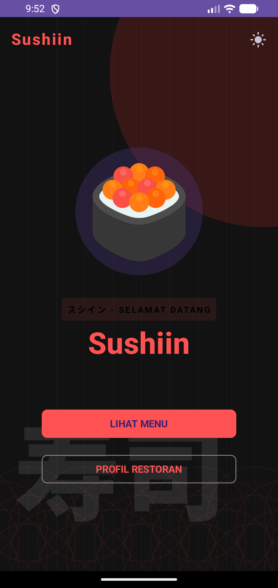
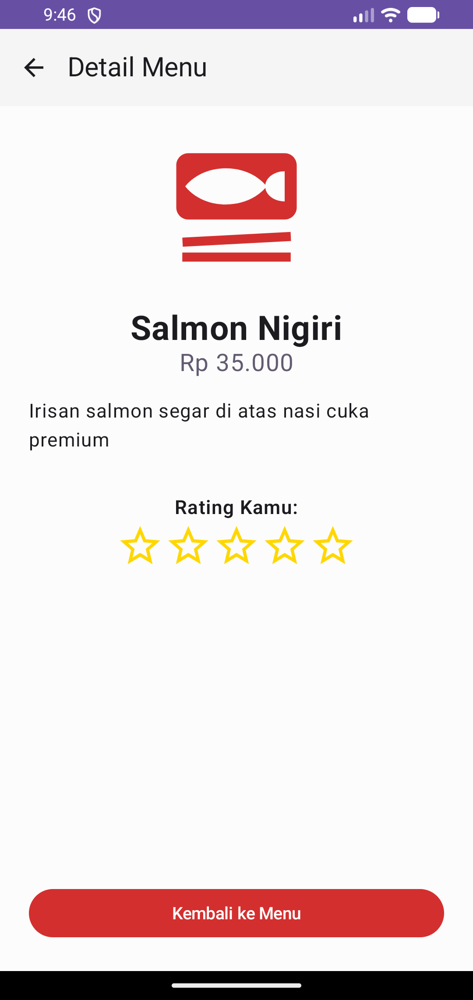
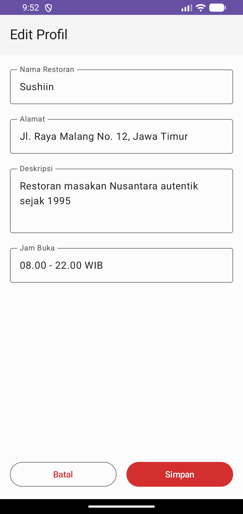

# Sushiin - Aplikasi Menu Restoran Sushi 🍣

Aplikasi Android modern berbasis Jetpack Compose yang dirancang untuk menampilkan menu restoran sushi dengan estetika desain Jepang yang autentik.

## ✨ Fitur Utama

- **Tampilan Beranda Tematik**: Desain antarmuka yang terinspirasi dari seni Jepang, lengkap dengan ornamen *Hinomaru* (lingkaran merah) dan pola *Seigaiha* (gelombang).
- **Mode Gelap (Dark Mode)**: Dukungan penuh untuk mode terang dan gelap yang dapat diganti secara instan untuk kenyamanan visual.
- **Daftar Menu Interaktif**: Menampilkan berbagai pilihan menu sushi dengan harga, deskripsi, dan ikon menarik menggunakan animasi transisi yang halus.
- **Detail Menu**: Informasi lengkap mengenai setiap item menu untuk membantu pelanggan memilih hidangan favorit mereka.
- **Profil Restoran**: Halaman informasi detail mengenai restoran, termasuk alamat, jam operasional, dan filosofi restoran.
- **Edit Profil (Manajemen Lokal)**: Fitur untuk mengubah informasi restoran (nama, alamat, deskripsi) yang disimpan secara lokal menggunakan *SharedPreferences*.
- **Navigasi Mulus**: Implementasi *Jetpack Compose Navigation* untuk perpindahan antar halaman yang cepat dan ringan.

## 🛠️ Teknologi yang Digunakan

- **Bahasa**: Kotlin
- **UI Framework**: Jetpack Compose (Material 3)
- **Navigasi**: Compose Navigation
- **Penyimpanan**: SharedPreferences (untuk data profil)
- **Desain**: Custom Canvas drawing untuk ornamen grafis

## 📸 Tampilan Aplikasi

| Beranda | Daftar Menu | Profil |
|---|---|---|
|  |  |  |

| Dark Mode | Detail Menu | Edit Profil |
|---|---|---|
|  |  |  |

---

Dikembangkan dengan ❤️ oleh [Gerryrag](https://github.com/Gerryrag)
